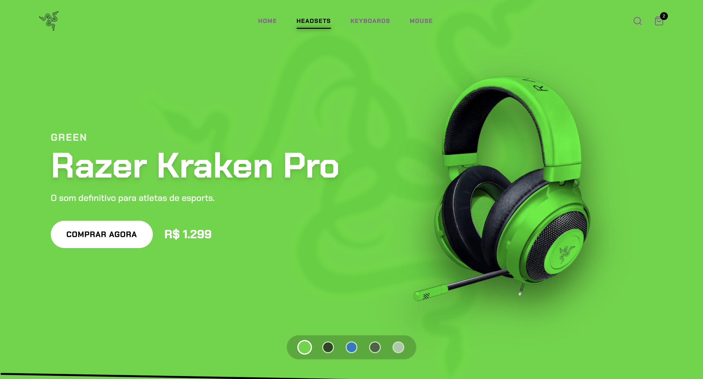
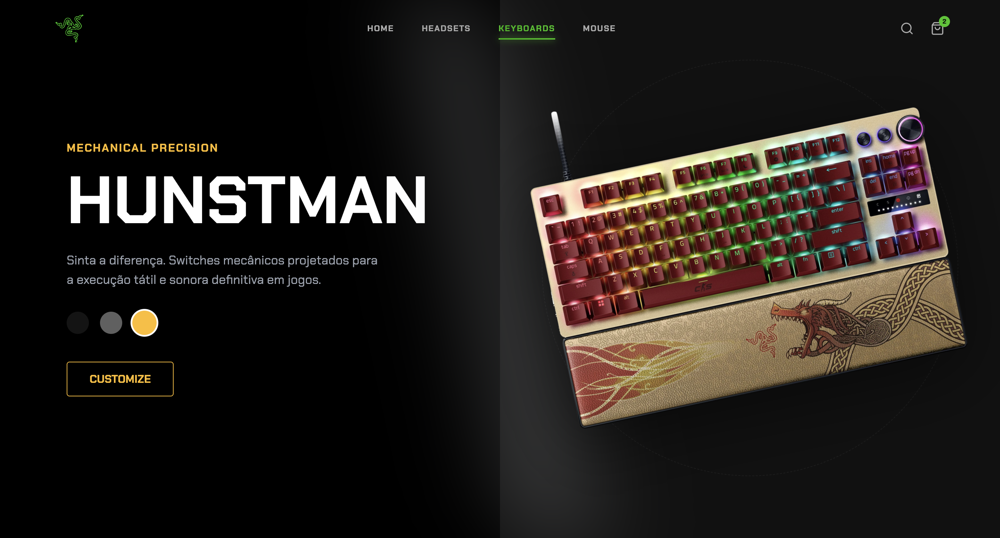
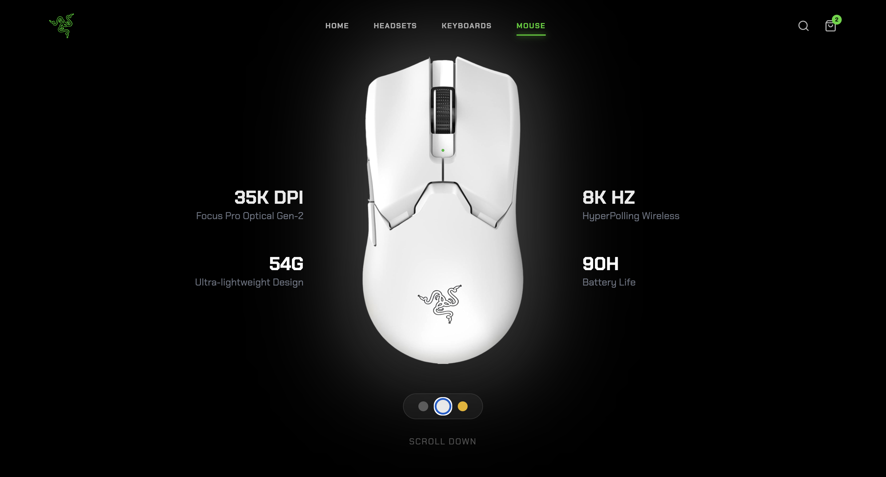

<h1 align="center">

</h1>

<strong>A Próxima Geração de E-commerce: Imersão, Interatividade e Performance.</strong>

---

## 🎬 Vídeo do Projeto
Em breve...

---

## 🎯 Sobre o Projeto

**Project Genesis** é uma reinterpretação moderna e imersiva da experiência de compra online, inspirada no estilo **Cyberpunk Gamer** da Razer.  
O foco está em:

- Animações fluidas e cinematográficas  
- UI altamente responsiva  
- Scrollytelling interativo  
- Sistema de temas dinâmicos  
- Performance otimizada  

O projeto simula a sensação de navegar em um site premiado do **Awwwards**, oferecendo:

- ✨ Parallax e transições ultra suaves  
- 🎨 Troca ao vivo de cores e temas de produtos  
- 🎮 Cards com efeito 3D Fake (tilt + depth)  
- 🖱️ Elementos responsivos ao cursor  
- 🧈 Scroll “amanteigado” com física realista  

---

## ✨ Destaques Técnicos

| Feature | Descrição | Tecnologia |
|--------|-----------|------------|
| **Scrollytelling** | Elementos animados por progressão do scroll | Framer Motion + useScroll |
| **Theming Dinâmico** | Mudança instantânea de cores/luzes dos produtos | React State + Tailwind |
| **Smooth Scrolling** | Inércia e fluidez nível premium | Lenis Scroll |
| **3D Tilt Effect** | Profundidade e reflexos simulados nos cards | CSS Transform + Perspective |
| **Performance** | Preloader animado + código otimizado | React + SVG Animations |

---

## 📸 Screenshots & Showcase

### 🏠 Home Imersiva

### 🎧 Headsets (Parallax)

### ⌨️ Teclados (Theming Dinâmico)

### 🖱️ Mouses (Speed + Responsividade)

---

## 🌐 Acesse o Site do Projeto
``
https://projectrazerweb.vercel.app
``
